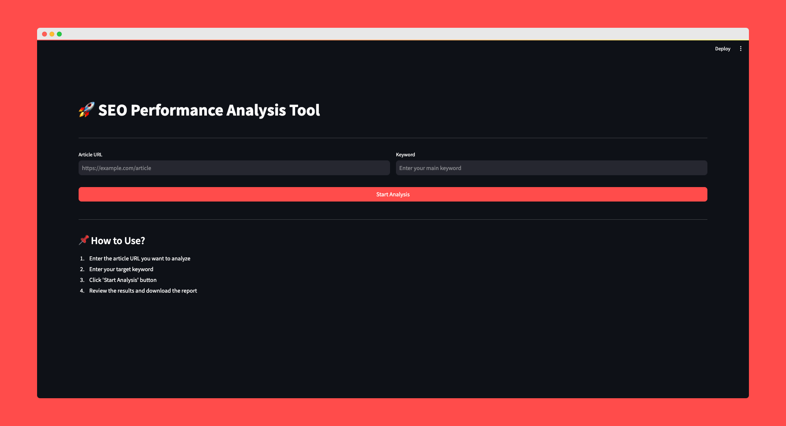
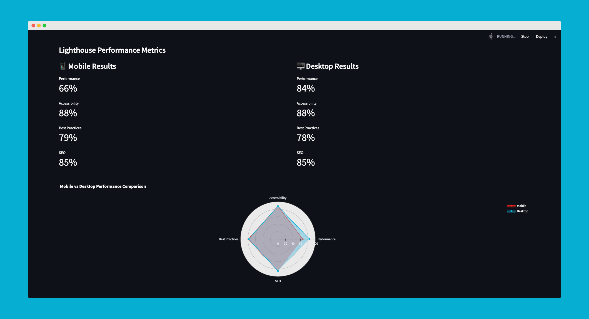
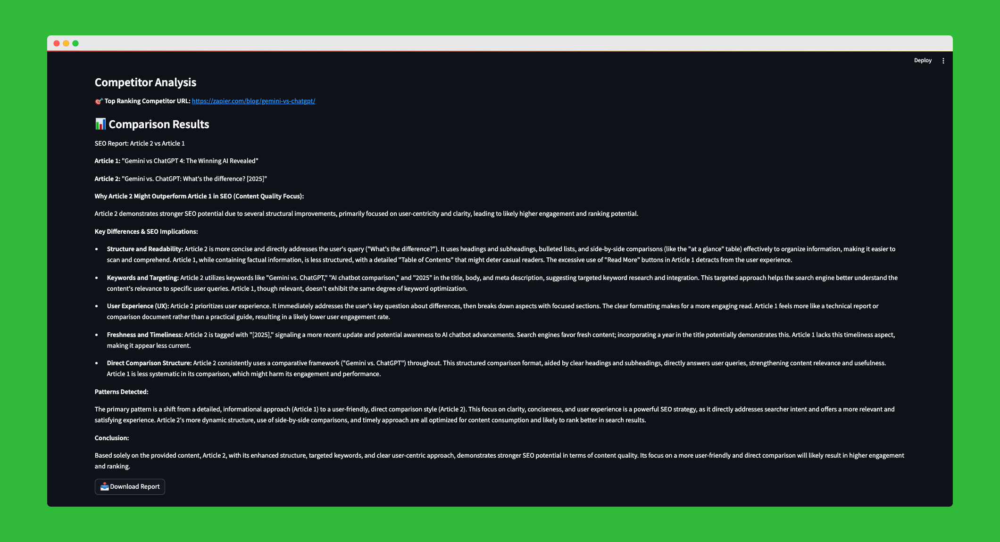
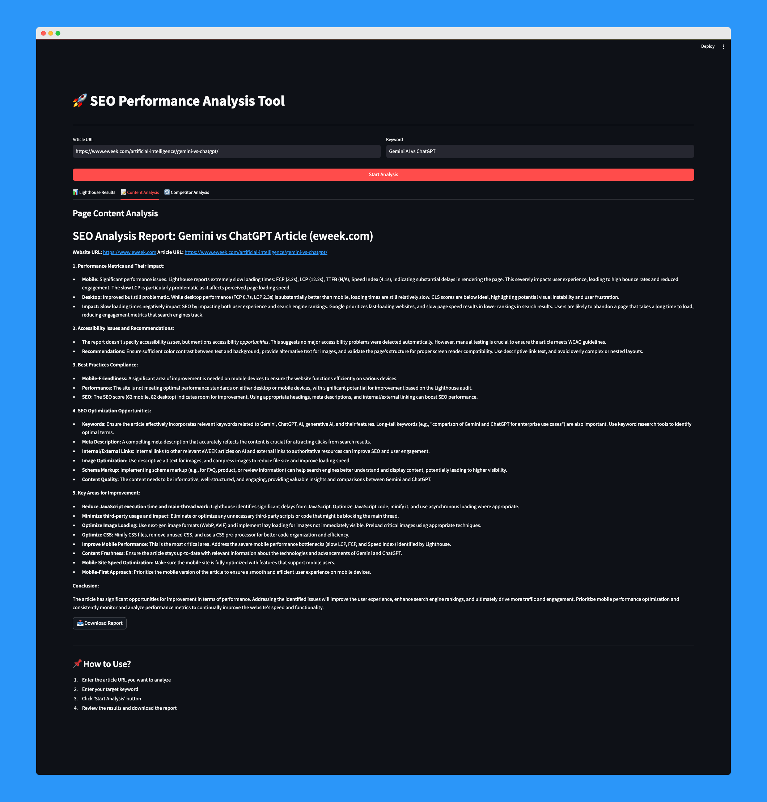

# 🚀 SEO Performance Analysis Tool

A comprehensive SEO analytics platform that combines performance analysis, competitor insights, and content evaluation in one powerful tool.



## 📋 Table of Contents
- [Features](#-features)
- [Technologies](#-technologies)
- [Installation](#-installation)
- [Usage](#-how-to-use)
- [API Configuration](#-api-configuration)
- [Sample Analysis](#-sample-analysis)
- [Contributing](#-contributing)
- [License](#-license)


## 🌟 Features

- **📊 Lighthouse Performance Analysis**
  - Mobile and Desktop performance metrics
  - Accessibility scores
  - Best practices evaluation
  - SEO scoring
  - Comparative radar chart



- **🔍 Competitor Analysis**
  - Automatic competitor detection
  - Content comparison
  - SEO strategy recommendations
  - Detailed comparison report



- **📝 Content Analysis**
  - Structural analysis
  - SEO optimization suggestions
  - Keyword usage
  - Improvement recommendations



## 🛠️ Technologies

- **Frontend:** Streamlit
- **Backend:** Python
- **APIs:**
  - Brightdata Scraping Browser
  - Brightdata Web Unlocker
  - Brightdata SERP API
  - Google Gemini AI

### Development Tools
- Python 3.12+
- Git (Version Control)
- Virtual Environment

## 🚀 Installation

1. Clone the repository:
```bash
git clone https://github.com/kenancn/seo-analysis-tool.git
cd seo-analysis-tool
```

2. Create and activate virtual environment:
```bash
python -m venv myenv
source myenv/bin/activate  # For Linux/Mac
myenv\\Scripts\\activate  # For Windows
```

3. Install requirements:
```bash
pip install -r requirements.txt
```

4. Create `.env` file and add your API keys:
```env
GEMINI_API_KEY="your-gemini-api-key"
BRIGHTDATA_API_KEY="your-brightdata-api-key"
BRIGHTDATA_AUTH="your-brightdata-auth"
```

5. Run the application:
```bash
streamlit run app.py
```

## 💡 API Configuration

This tool requires the following API keys:

1. **Google Gemini AI API**
   - Sign up at [Google AI Studio](https://aistudio.google.com/)
   - Create an API key
   - Add to `.env` or Streamlit secrets

2. **Brightdata API**
   - Register at [Brightdata](https://brightdata.com/)
   - Set up Scraping Browser, Web Unlocker and SERP API
   - Generate API key and authentication token
   - Add to `.env` or Streamlit secrets

## 💡 How to Use?

1. Enter URL and keyword
2. Click "Start Analysis" button
3. Review the analysis results:
   - Lighthouse performance metrics
   - Content analysis report
   - Competitor analysis results
4. Download results in CSV format

## 🌐 Live Demo

Access the live version of the application [here](https://seo-analysis-tool.streamlit.app/)


## 📈 Sample Analysis


## 🤝 Contributing

We welcome contributions! Please follow these steps:

1. Fork the repository
2. Create your feature branch
3. Follow our coding standards:
   - Use type hints
   - Add docstrings
   - Follow PEP 8
4. Submit a pull request

## 📝 License

This project is licensed under the MIT License - see the [LICENSE](LICENSE) file for details.

